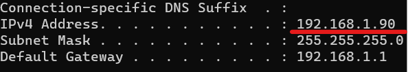
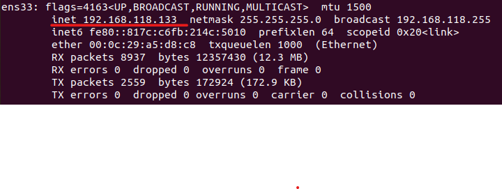

# remote-CMD

This is a script for remote execution of operating system command line commands within the local network.

### Installing packages:
Install [python3](https://www.python.org/downloads/)
```
pip install colorama
pip install platform
pip install socket
```

### How to use?

In the first step, to run this script, you need to know the IP that the operating system got from the DHCP server. To do this, use the `ipconfig` command in Windows and the `ifconfig` command in Linux.
<br>
<h2>In Windows:</h2>
  <a href="https://github.com/Arvinrjb/remote-CMD"></a>
<hr>
<h2>In Linux:</h2>
  <a href="https://github.com/Arvinrjb/remote-CMD"></a>
<hr>

In the first step, run the main.py script on your host system and enter the IP you found in the previous step.
And here the work with the first system ends!

Now run the client.py script on your other system from which you send your commands to the host, and in the first step, enter the same IP that the host is listening to.

The work is done and you can send your orders, I hope you enjoy it

## Warning!!

Avoid running it when you don't need it because this program can create security problems for your system and be subject to external attacks
