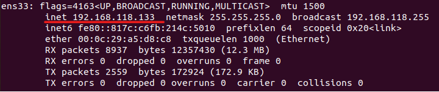

# remote-CMD

This is a script for remote execution of operating system command line commands within the local network.

### Installing packages:
Install [python3](https://www.python.org/downloads/)
```
pip install colorama
```

### How to use?

In the first step, to run this script, you need to know the IP that the operating system has obtained from the DHCP server (if you use the automatic mode to detect the IP, you don't need to do this anymore) for this, use the `ipconfig` command in Windows and the `ifconfig` command in Use Linux.
<br>
<h2>In Windows:</h2>
  <a href="https://github.com/Arvinrjb/remote-CMD"></a>
<hr>
<h2>In Linux:</h2>
  <a href="https://github.com/Arvinrjb/remote-CMD"></a>
<hr>

In the second step, run the main.py script on your server system and enter the IP you found in the previous step (or use the automatic mode) and then specify the TCP or UDP type.
And this is the end of the first system!


Now run the client.py script on your other system from which you send your commands to the server and enter the same IP that the server listens to and after entering your commands specify the type of TCP or UDP. (use the one that the server listens to)

The work is done and you can send your orders, I hope you enjoy it

## Warning!!

Avoid running it when you don't need it because this program can create security problems for your system and be subject to external attacks
